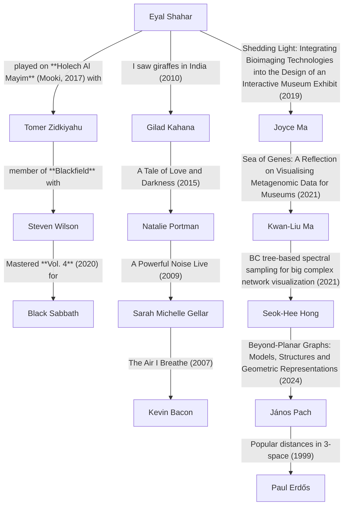

```mermaid
graph TD
  ES[Eyal Shahar]
  TZ[Tomer Zidkiyahu]
  SW[Steven Wilson]
  BS[Black Sabbath]

  ES -->|"played on **Holech Al Mayim** (Mooki, 2017) with"| TZ 
  TZ -->|member of **Blackfield** with|SW
  SW -->|"Mastered **Vol. 4** (2020) for"|BS  

  GK[Gilad Kahana]
  NP[Natalie Portman]
  SMG[Sarah Michelle Gellar]
  KB[Kevin Bacon]

  ES-->|"I saw giraffes in India (2010)"|GK
  GK-->|"A Tale of Love and Darkness (2015)"|NP
  NP-->|"A Powerful Noise Live (2009)"|SMG 
  SMG-->|"The Air I Breathe (2007)"|KB

  JM[Joyce Ma]
  KLM[Kwan-Liu Ma]
  SHH[Seok-Hee Hong]
  JP[János Pach]
  PE[Paul Erdős]

  ES-->|"Shedding Light: Integrating Bioimaging Technologies into the Design of an Interactive Museum Exhibit (2019)"|JM
  JM-->|"Sea of Genes: A Reflection on Visualising Metagenomic Data for Museums (2021)"|KLM
  KLM-->|"BC tree-based spectral sampling for big complex network visualization (2021)"|SHH
  SHH-->|"Beyond-Planar Graphs: Models, Structures and Geometric Representations (2024)"|JP
  JP-->|"Popular distances in 3-space (1999)"|PE
```

